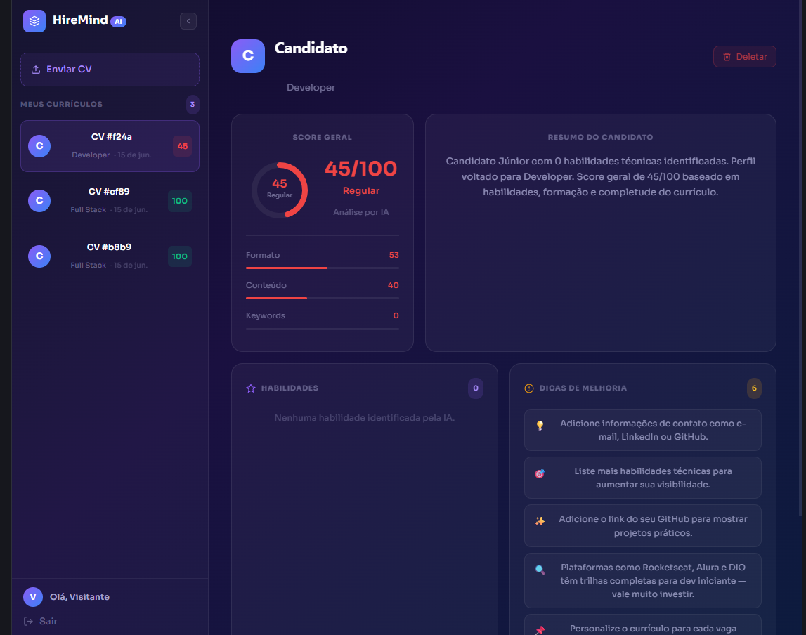

# HireMind AI 🧠

Sistema que analisa currículos automaticamente usando IA — faz upload do PDF, extrai as habilidades, classifica o nível do candidato e dá um score com dicas de melhoria.


**Acesse:** https://hiremind-ai-fawn.vercel.app

---

## Sobre

Comecei esse projeto querendo entender como integrar IA com uma aplicação real. A ideia foi criar algo útil: você sobe um currículo em PDF, o sistema lê o texto, identifica as tecnologias e devolve uma análise com score, habilidades encontradas e dicas de melhoria.

O backend é uma API em FastAPI com autenticação JWT e banco PostgreSQL. O frontend é em React com um dashboard onde você vê todos os CVs analisados.

## Desafios

O maior ponto de virada foi o fluxo de autenticação. No início, o cadastro e login eram feitos direto pelo Swagger do FastAPI — o usuário tinha que abrir a documentação da API, registrar a conta por lá, copiar o token e só então conseguia usar o sistema. Funcionava, mas era horrível de usar.

Decidi refazer isso do zero no frontend: criei as telas de login e cadastro em React, conectei com a API e fiz o token ser salvo automaticamente. Além de ficar muito mais usável, me fez entender melhor como JWT funciona na prática — como o token trafega, onde armazenar, como enviar no header de cada requisição.

Outro ponto foi a organização do repositório. O frontend estava dentro da pasta `backend/`, o que não fazia sentido nenhum. Reestruturei tudo com `frontend/` e `backend/` separados na raiz, o que deixou o projeto muito mais legível.

## Como usar

A forma mais rápida de testar sem criar conta:

1. Acesse https://hiremind-ai-fawn.vercel.app
2. Clique em **Entrar como visitante**
3. Clique em **Enviar CV** e selecione um PDF
4. Veja o score, habilidades detectadas e dicas de melhoria

Para salvar seus CVs permanentemente, crie uma conta gratuita em **Criar conta**.

> O servidor pode levar até 50 segundos para acordar no primeiro acesso do dia — é comportamento normal do plano gratuito do Render.

## Funcionalidades

- Upload de currículos em PDF
- Extração automática de habilidades técnicas
- Classificação por nível (Júnior, Pleno, Sênior)
- Score de 0 a 100 com sub-scores de formato, conteúdo e keywords
- Dicas personalizadas de melhoria por nível
- Cadastro e login pelo próprio site
- Acesso como visitante sem criar conta (dados salvos localmente)

## Stack

**Backend:** Python, FastAPI, SQLAlchemy, PostgreSQL, JWT (python-jose), bcrypt, pdfplumber

**Frontend:** React, Vite, Axios

**Deploy:** Render (backend) + Vercel (frontend) + Neon (banco) + UptimeRobot (monitoramento)

## Screenshots

### Login


### Dashboard


## Como rodar localmente

```bash
# Backend
cd backend
pip install -r requirements.txt
uvicorn app.main:app --reload

# Frontend (outro terminal)
cd frontend
npm install
npm run dev
```

Precisa criar um arquivo `.env` dentro de `backend/` com:
```
DATABASE_URL=sua_url_do_banco
SECRET_KEY=qualquer_string_longa
ALGORITHM=HS256
```

## Estrutura

```
hiremind-ai/
├── frontend/        # React + Vite
│   └── src/
├── backend/         # FastAPI
│   ├── app/
│   └── requirements.txt
└── render.yaml
```

## Licença

Este projeto está sob a licença MIT. Veja o arquivo [LICENSE](LICENSE) para mais detalhes.

---

Desenvolvido por Pedro Aruanã
