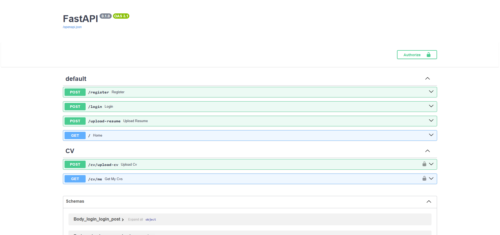

# 🧠 HireMind AI

> Sistema full-stack de análise de currículos com inteligência artificial.  
> Faça upload do seu CV em PDF e receba um relatório completo com score, habilidades, dicas e muito mais.


---

## 🌐 Acesse o Projeto

| | Link |
|---|---|
| 🔵 Frontend | https://hiremind-ai-fawn.vercel.app |
| ⚙️ Backend | https://hiremind-ai-tw8s.onrender.com |
| 📄 API Docs | https://hiremind-ai-tw8s.onrender.com/docs |

---

## 📌 Sobre o Projeto

O **HireMind AI** permite que usuários façam upload de currículos em PDF e utilize IA para extrair informações relevantes automaticamente, como:

- 🧩 Habilidades técnicas identificadas
- 📊 Nível de experiência (Júnior, Pleno, Sênior)
- 💼 Função sugerida (Frontend, Backend, Full Stack)
- 💡 Dicas personalizadas de melhoria
- 📈 Score geral do currículo (0–100)

---

## ⚙️ Funcionalidades

- 📄 Upload de currículos em PDF
- 🔐 Cadastro e login direto pelo site (sem etapas externas)
- 🧠 Análise automática com IA
- 🧩 Extração de habilidades técnicas
- 📊 Classificação de nível profissional
- 💡 Dicas personalizadas de melhoria
- 📈 Score detalhado com sub-scores (Formato, Conteúdo, Keywords)
- 💻 Dashboard interativo com sidebar

---

## 🛠️ Tecnologias

**Backend**
- Python 3.13
- FastAPI
- SQLAlchemy + PostgreSQL
- JWT Authentication (python-jose)
- Bcrypt (passlib)
- pdfplumber

**Frontend**
- React + Vite
- Axios
- JavaScript (ES6+)

---

## 📸 Screenshots

### 🔐 Tela de Login / Cadastro


### 📄 Dashboard com CVs


### 🧠 Análise de Currículo


---

## 🚀 Como Executar Localmente

### 1. Clonar o repositório
```bash
git clone https://github.com/Pedroaruana/hiremind-ai.git
cd hiremind-ai
```

### 2. Rodar o Backend
```bash
cd backend
pip install -r requirements.txt
uvicorn app.main:app --reload
```
> API disponível em: `http://localhost:8000`

> Em produção: `https://hiremind-ai-tw8s.onrender.com`

### 3. Rodar o Frontend
```bash
cd frontend
npm install
npm run dev
```
> Frontend disponível em: `http://localhost:5173`

---

## 🔐 Como Usar

1. Acesse o [frontend](https://hiremind-ai-fawn.vercel.app)
2. Clique em **"Criar conta"** e cadastre-se
3. Faça login com suas credenciais
4. Clique em **"Enviar CV"** na barra lateral e selecione seu PDF
5. Veja a análise completa do currículo no dashboard

---

## 📂 Estrutura do Projeto

```
hiremind-ai/
├── frontend/               → React + Vite (interface do usuário)
│   ├── src/
│   │   ├── App.jsx
│   │   ├── Login.jsx
│   │   └── Dashboard.jsx
│   └── package.json
├── backend/                → FastAPI (API e lógica)
│   ├── app/
│   │   ├── main.py
│   │   ├── routes/
│   │   ├── models/
│   │   ├── services/
│   │   └── database/
│   └── requirements.txt
├── render.yaml
└── README.md
```

---

## 👨‍💻 Autor

Desenvolvido por **Pedro**.
