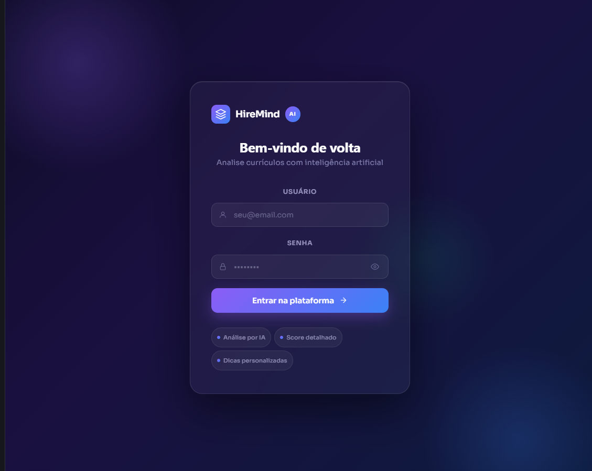
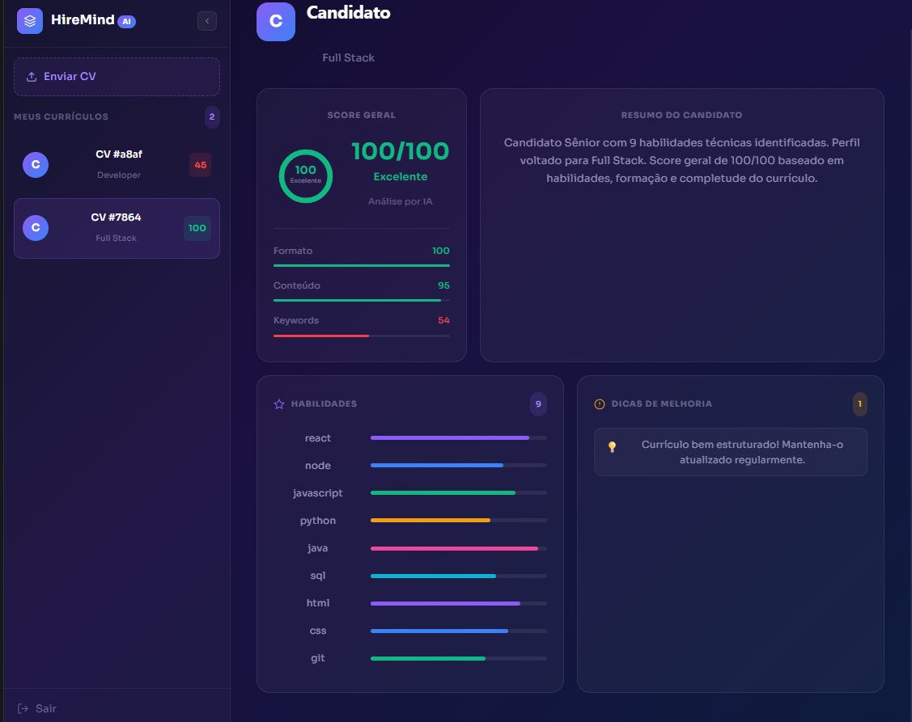

🧠 HireMind AI

Sistema full-stack que utiliza inteligência artificial para analisar currículos automaticamente, extrair habilidades e classificar candidatos por nível de experiência.

📌 Sobre o Projeto

O HireMind AI permite que usuários façam upload de currículos em PDF e utiliza IA para extrair informações relevantes automaticamente, como:

🧩 Habilidades técnicas
📊 Nível de experiência (Júnior, Pleno, Sênior)
💼 Função sugerida (Frontend, Backend, Full Stack)

Os dados são processados e exibidos em um dashboard interativo.

⚙️ Funcionalidades
📄 Upload de currículos em PDF
🧠 Análise automática com IA
🧩 Extração de habilidades técnicas
📊 Classificação de nível profissional
💼 Sugestão de função (role)
🔐 Autenticação com JWT
📡 API REST com FastAPI
💻 Dashboard em React
🛠️ Tecnologias Utilizadas
Backend
Python
FastAPI
JWT Authentication
SQLite / PostgreSQL
Frontend
React (Vite)
Axios
JavaScript (ES6+)
📂 Estrutura do Projeto
backend/                 → API e lógica do sistema
backend/cv-dashboard/    → Frontend (React)
README.md                → Documentação

## 📸 Screenshots

### 🔐 Tela de Login

### 📄 Dashboard com CVs

### 🧠 Análise de Currículo

🚀 Como Executar o Projeto
1. Clonar o repositório
git clone https://github.com/Pedroaruana/hiremind-ai.git
cd hiremind-ai
2. Rodar o Backend
cd backend
pip install -r requirements.txt
uvicorn app.main:app --reload

👉 Backend rodando em:
https://hiremind-ai-production.up.railway.app

3. Rodar o Frontend
cd backend/cv-dashboard
npm install
npm run dev

👉 Frontend local:
http://localhost:5173

👉 Frontend em produção:
https://hiremind-ai-fawn.vercel.app/

🌐 Links do Projeto
🔵 Frontend: https://hiremind-ai-fawn.vercel.app/
⚙️ Backend: https://hiremind-ai-production.up.railway.app/
📄 API Docs: https://hiremind-ai-production.up.railway.app/docs
🔐 Autenticação

O sistema utiliza JWT:

Usuário faz login
Token é armazenado no localStorage

Token é enviado nas requisições:

Authorization: Bearer <token>
API retorna dados do usuário autenticado
👨‍💻 Autor

Projeto desenvolvido por Pedro.